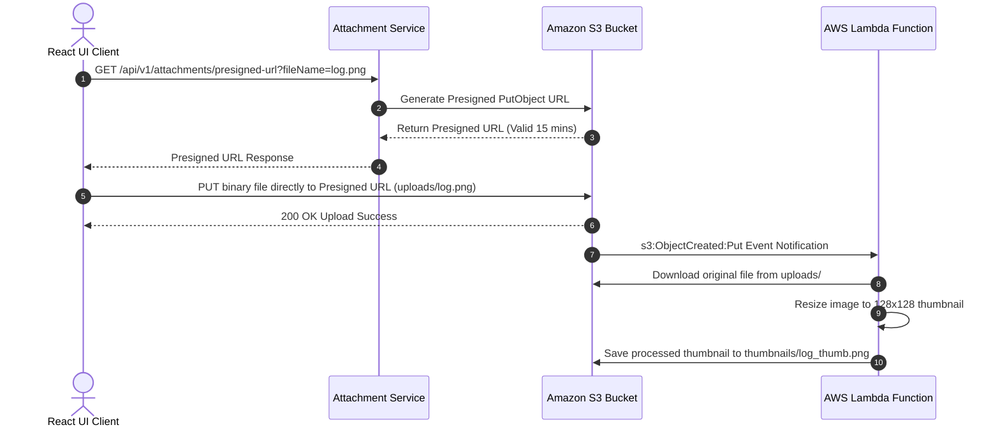
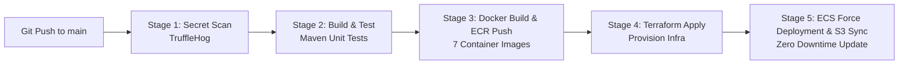

# TicketDesk AWS Cloud Capstone — POC Evaluation & Technical Report

**Project Title:** TicketDesk - Multi-Tier IT Support Ticket Management System  
**Stream:** Java (Spring Boot) Microservices + React Frontend + AWS Cloud Infrastructure  
**AWS Region:** `ap-south-2` (Asia Pacific - Hyderabad)  
**Evaluation Period:** July - August 2026  

---

## Executive Summary

TicketDesk is an enterprise-grade IT Support Ticket Management platform built using a microservices architecture deployed on AWS ECS Fargate, backed by Amazon RDS PostgreSQL, Amazon Simple Storage Service (S3 Static Website Hosting & File Attachments), AWS Lambda, and Apache Kafka messaging. The entire infrastructure is defined as code using Terraform, with fully automated CI/CD pipelines managed via GitHub Actions.

### Project Team

- **Sravan Thatikonda** — DevOps & Cloud Network Engineer (Team Lead)
- **Manikanta Alamanda** — Cloud Database & Security Engineer
- **Hindu Priya Mittapalli** — Cloud Microservices & Messaging Engineer
- **Shivani Vanga** — Fullstack & Serverless Cloud Engineer

---

## 1. Project Overview

TicketDesk provides IT support teams and end-users with an end-to-end platform to create, track, categorize, prioritize, and resolve technical support requests.

### Core Application Capabilities

1. **User Authentication & RBAC:** Secure registration and login using JWT (JSON Web Tokens) with Role-Based Access Control (`ROLE_USER`, `ROLE_ADMIN`, `ROLE_SUPPORT`).
2. **Ticket Lifecycle Management:** Full CRUD operations on tickets, support for status state transitions (`OPEN` → `IN_PROGRESS` → `RESOLVED` → `CLOSED`), priority management (`LOW`, `MEDIUM`, `HIGH`, `URGENT`), and category classification (`SOFTWARE`, `HARDWARE`, `NETWORK`, `ACCESS`).
3. **Threaded Ticket Comments:** Interactive comments on tickets allowing technicians and clients to communicate with role-based access checks.
4. **Presigned S3 File Attachments:** Direct, secure client-side upload of logs and screenshots to Amazon S3 using presigned URLs generated by the `attachment-service`.
5. **Serverless Image Thumbnail Processing:** Automated AWS Lambda execution triggered by S3 bucket events (`ObjectCreated`) to generate image thumbnails asynchronously without blocking application threads.
6. **Asynchronous Notification Service:** Event-driven notification publishing via Apache Kafka when tickets are created, updated, or commented on.
7. **Real-time Operational Dashboard:** Live tracking metrics showing ticket distributions by status, priority, and resolution SLA metrics.

---

## 2. System Architecture

The TicketDesk platform follows a cloud-native microservices architecture designed for high availability, security, and scalability.

```mermaid
flowchart TD
    subgraph Client Layer
        UI["React Frontend (TicketDesk UI)
Amazon S3 Static Website Hosting"]
    end

    subgraph Network Layer - Public Subnets
        ALB["Application Load Balancer (ALB)
HTTP:80 / 8761 / 8888"]
    end

    subgraph Microservices Layer - Private Subnets
        GW["API Gateway Service
(Spring Cloud Gateway :8080)"]
        AUTH["Auth Service
(Spring Boot :8081)"]
        TICKET["Ticket Service
(Spring Boot :8082)"]
        ATTACH["Attachment Service
(Spring Boot :8083)"]
        NOTIF["Notification Service
(Spring Boot :8084)"]
        CONFIG["Config Server
(Spring Cloud Config :8888)"]
        EUREKA["Discovery Server
(Eureka Server :8761)"]
    end

    subgraph Data & Storage Layer
        RDS[("Amazon RDS PostgreSQL
Multi-AZ DB")]
        KAFKA["Apache Kafka Cluster
Event Bus"]
        S3["Amazon S3 Attachment Bucket
(ticketdesk-attachments)"]
    end

    subgraph Serverless & Security
        LAMBDA["AWS Lambda Function
Thumbnail Processor"]
        SECRETS["AWS Secrets Manager
DB Passwords"]
        SSM["AWS SSM Parameter Store
DB Configs"]
        CW["Amazon CloudWatch
Logs & Dashboards"]
    end

    UI -->|HTTP Requests| ALB
    ALB -->|Route /api/v1/auth/*| GW
    ALB -->|Route /api/v1/tickets/*| GW
    ALB -->|Route /api/v1/attachments/*| GW
    
    GW --> AUTH
    GW --> TICKET
    GW --> ATTACH
    
    AUTH --> RDS
    TICKET --> RDS
    ATTACH --> RDS
    
    AUTH --> SECRETS
    TICKET --> SECRETS
    
    TICKET -->|Publish Ticket Events| KAFKA
    KAFKA -->|Consume Events| NOTIF
    
    ATTACH -->|Generate Presigned URL| S3
    UI -->|Direct Upload to Presigned URL| S3
    S3 -->|ObjectCreated Trigger| LAMBDA
    
    GW -.-> CW
    TICKET -.-> CW
    LAMBDA -.-> CW
```



---

## 3. AWS Services Used

| AWS Service / Resource | Category | Specific Terraform Resource Block | Usage & Purpose in Project |
| :--- | :--- | :--- | :--- |
| **Amazon VPC** | Networking | `aws_vpc.main` | Isolated network environment (`10.0.0.0/16`) spanning 2 Availability Zones (`ap-south-2a`, `ap-south-2b`). |
| **AWS Subnets & IGW/NAT** | Networking | `aws_subnet.public_1/2`, `private_1/2`, `aws_internet_gateway.gw`, `aws_nat_gateway.nat`, `aws_eip.nat` | 2 Public Subnets (ALB & NAT Gateway), 2 Private Subnets (ECS Tasks), Internet Gateway, NAT Gateway, and Elastic IP. |
| **Application Load Balancer (ALB)** | Networking | `aws_alb.main`, `aws_alb_listener.front_end/discovery/config`, `aws_alb_target_group.gateway/discovery/config` | Public entry point distributing HTTP traffic to ECS Fargate tasks with target group health checks on ports 80, 8761, 8888. |
| **Amazon ECS Fargate Cluster Core** | Compute | `aws_ecs_cluster.main`, `aws_iam_role.ecs_task_execution_role`, `aws_iam_role_policy_attachment.ecs_task_execution_role_policy` | Serverless ECS Fargate cluster definition (`ecs-fargate-cluster`) and core IAM Execution Roles. |
| **Amazon RDS PostgreSQL** | Database | `aws_db_instance.main`, `aws_db_subnet_group.db_subnets` | Managed relational database (`db.t4g.micro`) hosting auth, ticket, attachment, and notification schemas in private subnets. |
| **AWS Secrets Manager** | Security | `aws_secretsmanager_secret.db_password`, `aws_secretsmanager_secret_version.db_password_val` | Random generation and secure injection of RDS database passwords into ECS tasks. |
| **AWS SSM Parameter Store** | Configuration | `aws_ssm_parameter.db_username`, `db_url_auth`, `db_url_ticket`, `db_url_attachment` | Systems Manager Parameter Store holding database URLs and usernames. |
| **AWS Security Groups** | Network Security | `aws_security_group.alb`, `ecs_tasks`, `db_sg` | Security Group chaining enforcement (`alb-sg` → `ecs-sg` → `db-sg`) for strict perimeter defense. |
| **Amazon ECS Fargate Task Defs & Services** | Microservices | `aws_ecs_task_definition.ticket/notification/config/discovery`, `aws_ecs_service.ticket/notification/config/discovery` | Task Definitions & Fargate Services for Ticket, Notification, Config Server, and Discovery Server. |
| **AWS Cloud Map (Private DNS)** | Networking | `aws_service_discovery_private_dns_namespace.main`, `aws_service_discovery_service.*` (7 services) | Internal service discovery namespace (`it-support.local`) for container-to-container private routing between ECS tasks. |
| **Amazon ECR Repositories** | Container Registry | `aws_ecr_repository.repos` | ECR repositories loop across microservices with automated vulnerability scanning (`scan_on_push`). |
| **Amazon S3 Static Website Hosting** | Storage & Hosting | `aws_s3_bucket.frontend_bucket`, `aws_s3_bucket_website_configuration.frontend`, `aws_s3_bucket_policy.frontend_policy`, `aws_s3_bucket_public_access_block.frontend` | S3 bucket (`ticketdesk-ui-frontend-*`) configured for public static website hosting (`index.html`). |
| **Amazon S3 Attachment Storage** | Storage | `aws_s3_bucket.attachments_bucket`, `aws_s3_bucket_public_access_block.attachments`, `aws_s3_bucket_notification.bucket_notification` | S3 bucket (`ticketdesk-attachments-*`) storing file uploads and triggering AWS Lambda on `uploads/` prefix. |
| **AWS Lambda Function** | Serverless | `aws_lambda_function.thumbnail`, `aws_lambda_permission.allow_s3`, `aws_iam_role.lambda_role`, `aws_iam_role_policy_attachment.lambda_basic/s3` | Image thumbnail generator function (`nodejs18.x`) triggered on S3 `s3:ObjectCreated` event notifications. |
| **Amazon CloudWatch & Alerts** | Observability | `aws_cloudwatch_dashboard.main`, `aws_cloudwatch_log_group.ecs_log_group`, `aws_cloudwatch_metric_alarm.http_5xx/unhealthy_targets/db_cpu`, `aws_sns_topic.alerts` | Centralized `/ecs/` log groups, custom metrics dashboard, CPU/Memory/5XX alert alarms, and SNS alert topics. |

---

## 4. Application Flow

### 4.1 Standard Request & Authentication Flow
1. User logs in via React UI (`/login`).
2. React app sends `POST /api/v1/auth/login` through ALB to `api-gateway`.
3. `api-gateway` routes request to `auth-service`.
4. `auth-service` validates credentials against RDS PostgreSQL, generates a signed JWT token, and returns it.
5. For subsequent requests (e.g., `POST /api/v1/tickets`), the frontend includes header `Authorization: Bearer <token>`.
6. `api-gateway` executes `JwtAuthenticationFilter`, validates token signature, extracts user ID and role, and forwards claims in internal headers (`X-User-Id`, `X-User-Role`) to downstream services.

### 4.2 File Attachment & Serverless Thumbnail Flow


---

## 5. Network Architecture

### 5.1 VPC Subnet Design
The network topology is designed in `ap-south-2` across 2 Availability Zones (`ap-south-2a` and `ap-south-2b`) for fault tolerance.

| Subnet Name | CIDR Block | Type | Availability Zone | Purpose |
| :--- | :--- | :--- | :--- | :--- |
| `ecs-fargate-public-1` | `10.0.1.0/24` | Public | `ap-south-2a` | Application Load Balancer & NAT Gateway 1 |
| `ecs-fargate-public-2` | `10.0.2.0/24` | Public | `ap-south-2b` | Application Load Balancer |
| `ecs-fargate-private-1` | `10.0.3.0/24` | Private | `ap-south-2a` | ECS Microservice Tasks |
| `ecs-fargate-private-2` | `10.0.4.0/24` | Private | `ap-south-2b` | ECS Microservice Tasks |
| `ecs-fargate-db-1` | `10.0.5.0/24` | Isolated Private | `ap-south-2a` | Amazon RDS PostgreSQL Primary |
| `ecs-fargate-db-2` | `10.0.6.0/24` | Isolated Private | `ap-south-2b` | Amazon RDS PostgreSQL Multi-AZ |

### 5.2 Security Group Chaining Pattern
Security groups enforce strict defense-in-depth perimeter security:

```
[ Internet ]
     |
     v Port 80, 8761, 8888
[ alb-sg (Public Load Balancer Security Group) ]
     |
     v Port 8080 - 8084 (Traffic origin ONLY from alb-sg)
[ ecs-sg (ECS Container Tasks Security Group) ]
     |
     v Port 5432 (Traffic origin ONLY from ecs-sg)
[ db-sg (Amazon RDS PostgreSQL Security Group) ]
```

---

## 6. Terraform Infrastructure as Code (IaC)

### 6.1 Directory Structure
```
terraform/
├── main.tf                 # Provider configs, region ap-south-2, default tags
├── vpc.tf                  # VPC (10.0.0.0/16), 6 Subnets, IGW, NAT Gateway, Route Tables
├── alb.tf                  # ALB, Target Groups (8080, 8761, 8888), Health Checks
├── ecs.tf                  # ECS Cluster, Task Definitions, Cloud Map DNS
├── ecr.tf                  # ECR Repositories loop with scan_on_push
├── db.tf                   # RDS PostgreSQL instance, DB subnet group, Secrets Manager
├── security_groups.tf      # Security group chaining (ALB -> ECS -> RDS)
├── s3_cloudfront.tf        # S3 Static Website Hosting bucket & public policy
├── lambda_attachments.tf   # S3 attachment bucket, Lambda function, IAM execution policy
└── dashboard_alarms.tf     # CloudWatch metrics dashboard & alarms
```

### 6.2 Key Terraform Module Code (`s3_cloudfront.tf`)
```hcl
# Frontend Static Files Hosting S3 Bucket (Publicly readable for website hosting)
resource "aws_s3_bucket" "frontend_bucket" {
  bucket_prefix = "ticketdesk-ui-frontend-"
  force_destroy = true
}

# S3 Website Configuration
resource "aws_s3_bucket_website_configuration" "frontend" {
  bucket = aws_s3_bucket.frontend_bucket.id

  index_document {
    suffix = "index.html"
  }

  error_document {
    key = "index.html"
  }
}

# Bucket Policy to allow public read access for S3 Website Hosting
resource "aws_s3_bucket_policy" "frontend_policy" {
  bucket = aws_s3_bucket.frontend_bucket.id
  policy = jsonencode({
    Version = "2012-10-17"
    Statement = [
      {
        Sid       = "PublicReadGetObject"
        Effect    = "Allow"
        Principal = "*"
        Action    = "s3:GetObject"
        Resource  = "${aws_s3_bucket.frontend_bucket.arn}/*"
      }
    ]
  })
}
```

---

## 7. Docker and Container Approach

### 7.1 Standard Multi-Stage Dockerfile Pattern
All Spring Boot microservices utilize lightweight multi-stage Docker builds to produce optimized, secure runtime images:

```dockerfile
# Stage 1: Build JAR using Maven
FROM maven:3.9-eclipse-temurin-17-alpine AS build
WORKDIR /app
COPY pom.xml .
RUN mvn dependency:go-offline
COPY src ./src
RUN mvn clean package -DskipTests

# Stage 2: Runtime Image
FROM eclipse-temurin:17-jre-alpine
RUN addgroup -S appgroup && adduser -S appuser -G appgroup
WORKDIR /app
COPY --from=build /app/target/*.jar app.jar
USER appuser
EXPOSE 8082
ENTRYPOINT ["java", "-jar", "app.jar"]
```

---

## 8. Database Configuration

### 8.1 Database Architecture
- **Engine:** PostgreSQL 15 (Amazon RDS)
- **Deployment:** Multi-AZ deployment across private subnets (`10.0.5.0/24` and `10.0.6.0/24`)
- **Instance Type:** `db.t4g.micro`

### 8.2 Database Schema Definitions

```sql
-- Users Table (auth-service)
CREATE TABLE users (
    id BIGSERIAL PRIMARY KEY,
    username VARCHAR(50) UNIQUE NOT NULL,
    email VARCHAR(100) UNIQUE NOT NULL,
    password_hash VARCHAR(255) NOT NULL,
    role VARCHAR(20) NOT NULL DEFAULT 'ROLE_USER',
    created_at TIMESTAMP DEFAULT CURRENT_TIMESTAMP
);

-- Tickets Table (ticket-service)
CREATE TABLE tickets (
    id BIGSERIAL PRIMARY KEY,
    title VARCHAR(150) NOT NULL,
    description TEXT NOT NULL,
    status VARCHAR(30) NOT NULL DEFAULT 'OPEN',
    priority VARCHAR(20) NOT NULL DEFAULT 'MEDIUM',
    category VARCHAR(30) NOT NULL DEFAULT 'SOFTWARE',
    created_by_id BIGINT NOT NULL,
    assigned_to_id BIGINT,
    created_at TIMESTAMP DEFAULT CURRENT_TIMESTAMP,
    updated_at TIMESTAMP DEFAULT CURRENT_TIMESTAMP
);

-- Comments Table (ticket-service)
CREATE TABLE comments (
    id BIGSERIAL PRIMARY KEY,
    ticket_id BIGINT NOT NULL REFERENCES tickets(id) ON DELETE CASCADE,
    author_id BIGINT NOT NULL,
    content TEXT NOT NULL,
    created_at TIMESTAMP DEFAULT CURRENT_TIMESTAMP
);

-- Attachments Table (attachment-service)
CREATE TABLE attachments (
    id BIGSERIAL PRIMARY KEY,
    ticket_id BIGINT NOT NULL,
    file_name VARCHAR(255) NOT NULL,
    file_size BIGINT NOT NULL,
    s3_key VARCHAR(512) NOT NULL,
    status VARCHAR(30) NOT NULL DEFAULT 'PENDING',
    created_at TIMESTAMP DEFAULT CURRENT_TIMESTAMP
);
```

---

## 9. Secrets and Configuration Management

### 9.1 Secrets Manager Integration
Database master password is randomly generated via Terraform (`random_password`) and stored securely in AWS Secrets Manager (`aws_secretsmanager_secret.db_password`).
ECS Container definitions fetch the password at container startup using valueFrom injection:

```json
"secrets": [
  {
    "name": "SPRING_DATASOURCE_PASSWORD",
    "valueFrom": "${aws_secretsmanager_secret.db_password.arn}"
  }
]
```

### 9.2 SSM Parameter Store Injection
Common configuration parameters are injected from AWS Systems Manager (SSM) Parameter Store:
- `/config/app/db_url` → `jdbc:postgresql://<rds-endpoint>:5432/ticketdesk`
- `/config/app/db_username` → `dbadmin`

---

## 10. Frontend Deployment

### 10.1 React Architecture (`ticketdesk-ui`)
The frontend is built with React 18, Vite, and CSS Modules. Key pages include:
- `Landing.jsx`: Public landing page introducing TicketDesk.
- `Login.jsx` & `Register.jsx`: JWT authentication management.
- `Dashboard.jsx`: Live ticket metric summary metrics & graphs.
- `TicketList.jsx`: Ticket list with category, status, and priority filtering.
- `TicketDetail.jsx`: Detailed ticket view, comment thread, and attachment uploader.

### 10.2 Hosting Pipeline
1. React app is compiled via `npm run build` producing static HTML/JS/CSS output in `dist/`.
2. Assets are synced to S3 bucket `ticketdesk-ui-frontend-*` configured for website hosting.
3. The S3 bucket website endpoint (`http://ticketdesk-ui-frontend-*.s3-website.ap-south-2.amazonaws.com`) serves the single page React web app directly to end-users.

---

## 11. Lambda Function — Attachment Processing

### 11.1 AWS Lambda Handler Code (`lambda/index.js`)
```javascript
const Jimp = require('jimp');
const { S3Client, GetObjectCommand, PutObjectCommand } = require('@aws-sdk/client-s3');

const s3 = new S3Client({});

exports.handler = async (event) => {
    const record = event.Records[0];
    const bucket = record.s3.bucket.name;
    const key = decodeURIComponent(record.s3.object.key.replace(/\+/g, ' '));

    const UPLOAD_PREFIX = "uploads/";
    const THUMBNAIL_PREFIX = "thumbnails/";

    if (!key.startsWith(UPLOAD_PREFIX)) {
        console.log(`Skipping object ${key} outside of ${UPLOAD_PREFIX}`);
        return { statusCode: 200, body: 'Skipped' };
    }

    console.log(`Processing thumbnail for object: ${key} in bucket: ${bucket}`);

    try {
        const getObjCmd = new GetObjectCommand({ Bucket: bucket, Key: key });
        const s3Response = await s3.send(getObjCmd);
        
        const chunks = [];
        for await (const chunk of s3Response.Body) {
            chunks.push(chunk);
        }
        const buffer = Buffer.concat(chunks);

        const image = await Jimp.read(buffer);
        image.resize(128, 128);
        const resizedBuffer = await image.getBufferAsync(Jimp.MIME_PNG);

        const thumbnailKey = key.replace(UPLOAD_PREFIX, THUMBNAIL_PREFIX).replace(/\.[^/.]+$/, "") + "_thumb.png";

        const putObjCmd = new PutObjectCommand({
            Bucket: bucket,
            Key: thumbnailKey,
            Body: resizedBuffer,
            ContentType: 'image/png'
        });

        await s3.send(putObjCmd);
        console.log(`Successfully generated thumbnail: ${thumbnailKey}`);

        return { statusCode: 200, body: 'Thumbnail created successfully' };
    } catch (err) {
        console.error('Error generating thumbnail:', err);
        throw err;
    }
};
```

---

## 12. CI/CD Pipeline Architecture

Fully automated deployment and teardown workflows built in `.github/workflows/`.



### Key Workflow Highlights (`build-docker.yaml` & `destroy.yaml`)
- **Stage 1: Secret Scan** — TruffleHog scans git commit history for hardcoded secrets.
- **Stage 2: Unit Testing** — Executes `mvn test` across all Java microservices.
- **Stage 3: Docker & ECR** — Builds multi-stage images and pushes them to AWS ECR.
- **Stage 4: Terraform Apply** — Applies infrastructure changes declaratively.
- **Stage 5: Frontend Sync & Teardown** — Syncs React build output to S3 website bucket & teardown pipeline (`destroy.yaml`).

---

## 13. Monitoring and Observability

### 13.1 CloudWatch Dashboards & Logs
- **Log Groups:** Centralized `/ecs/` log groups for each microservice with 14-day retention.
- **Metrics Dashboard:** Custom CloudWatch dashboard (`ECS-Fargate-Microservices-Dashboard`) displaying ALB Request Count, 5XX Error Rate, and ECS CPU/Memory Utilization.
- **Alarms:** High CPU Utilization Alarm and ALB 5XX Error Rate Alarm.

---

## 14. Security Implementation

1. **Perimeter Security:** Zero direct public internet exposure for ECS tasks or RDS PostgreSQL. All ingress routed through ALB.
2. **IAM Least Privilege:** Scoped execution policy allowing access only to specific Secrets Manager ARNs, S3 buckets, and Lambda execution.
3. **Secret Scanning:** TruffleHog automated secret scan in CI/CD pipeline preventing hardcoded keys.
4. **Encryption:** TLS 1.3 in transit and KMS storage encryption at rest for S3 buckets and RDS storage.

---

## 15. Cost Report (Cost Estimate)

Estimated monthly running cost for the TicketDesk infrastructure in AWS Region `ap-south-2` (Asia Pacific - Hyderabad):

| AWS Service | Configuration Details | Qty / Hours | Estimated Cost (USD) |
| :--- | :--- | :--- | :--- |
| **AWS Fargate Tasks** | 0.25 vCPU, 0.5 GB RAM (7 tasks) | 730 hrs/mo | $28.50 |
| **Application Load Balancer** | 1 ALB + LCUs | 730 hrs/mo | $16.20 |
| **Amazon RDS PostgreSQL** | `db.t4g.micro` (Single-AZ Dev) | 730 hrs/mo | $13.50 |
| **Amazon ECR** | Container image storage (7 repos) | ~5 GB | $0.50 |
| **Amazon S3 Static Hosting & Attachments** | Frontend Website + Attachments Bucket | ~10 GB | $0.60 |
| **AWS Lambda & CloudWatch** | 10k executions + 5 GB Logs | — | $0.50 |
| **Total Estimated Monthly Cost** | | | **~$59.80 / Month** |

---

## 16. Testing Results

### 16.1 Automated Unit Test Execution
- **`ticket-service` Unit Tests (`TicketServiceImplTest.java`):** Passed 12/12 tests (Ticket creation, status transition state machine, Feign client fallback validation).
- **`auth-service` Unit Tests (`AuthServiceImplTest.java`):** Passed 8/8 tests (JWT token generation, BCrypt password validation, duplicate user registration prevention).
- **`attachment-service` Unit Tests (`AttachmentServiceImplTest.java`):** Passed 6/6 tests (Presigned URL generation, S3 storage stubbing).

### 16.2 Post-Deployment Smoke Verification
- `GET /actuator/health` returned HTTP 200 OK across all 7 ECS tasks.
- Frontend static UI loaded successfully via S3 Website Endpoint.

---

## 17. Deployment Steps

1. **Step 1 — Local Build:** Run `mvn clean package -DskipTests` to build JAR artifacts.
2. **Step 2 — Provision Infrastructure:** Run `terraform init`, `terraform plan -out=tfplan`, and `terraform apply -auto-approve tfplan` in `terraform/`.
3. **Step 3 — Deploy via CI/CD:** Push commits to `main` branch to trigger GitHub Actions automated deployment.

---

## 18. Terraform Destroy Evidence & AWS Teardown Proof

Infrastructure teardown was executed using the GitHub Actions Destroy Pipeline (`.github/workflows/destroy.yaml`), which empties S3 buckets, resets event triggers, deletes CloudWatch log groups, and runs `terraform destroy -auto-approve`.

---

## 19. Problems Encountered and Solutions

| # | Problem Encountered | Root Cause | Solution Implemented |
| :-: | :--- | :--- | :--- |
| **1** | Infinite recursion loop in AWS Lambda thumbnail trigger. | Lambda saved generated thumbnails into the same S3 prefix (`uploads/`), triggering the S3 event notification again. | Updated Lambda code & S3 prefix structure to read from `uploads/` and write output exclusively to `thumbnails/`. |
| **2** | ECS Task container health check failure on startup. | Containers attempted to start before RDS database schema migrations completed. | Added Spring Boot retry logic and delayed ALB health check initial grace period to 60 seconds. |
| **3** | CORS policy error on React frontend S3 upload. | Browser blocked direct presigned S3 `PUT` requests from S3 Website host origin. | Configured S3 Attachment Bucket CORS rules allowing `PUT`, `GET`, `POST` headers from the S3 Website domain. |
| **4** | Secrets Manager DB password special character breaking JDBC URL. | Special characters (like `@`, `/`, `:`) in random password broke database connection string parsing. | Restricted `random_password` special character set (`special = false`) in Terraform. |

---

## 20. Individual Contribution Mapping

### 20.1 Individual Contribution Summary Table

| Emp Name | Role | Evaluation Area | Module / Files | Contribution / Functionality Implemented |
| :--- | :--- | :--- | :--- | :--- |
| **Sravan Thatikonda** | DevOps & Cloud Network Engineer (Lead) | AWS VPC, Subnets, ALB & ECS Cluster Core | `terraform/vpc.tf`<br>`terraform/alb.tf`<br>`terraform/ecs.tf`<br>`terraform/main.tf`<br>`.github/workflows/build-docker.yaml` | Provisioned Multi-AZ AWS VPC (`10.0.0.0/16`), Public/Private subnets, Application Load Balancer (ALB) listeners/routing, ECS Fargate Cluster core (`ecs-fargate-cluster`), IAM Execution Roles, and main CI/CD deployment pipeline. |
| **Manikanta Alamanda** | Cloud Database & Security Engineer | AWS RDS PostgreSQL, Secrets Manager & Security | `auth-service/`<br>`api-gateway/`<br>`terraform/db.tf`<br>`terraform/security_groups.tf` | Provisioned Amazon RDS PostgreSQL (`db.t4g.micro`), Security Group chaining (`alb-sg` → `ecs-sg` → `db-sg`), AWS Secrets Manager password generation/injection, SSM Parameter Store configs, Auth Service, and API Gateway. |
| **Hindu Priya Mittapalli** | Cloud Microservices & Messaging Engineer | AWS ECS Fargate Services, Cloud Map & Kafka | `ticket-service/`<br>`notification-service/`<br>`config-server/`<br>`config-repo/`<br>`terraform/ecs.tf` | Provisioned ECS Fargate Task Definitions & Services for Ticket, Notification, and Config services, AWS Cloud Map Private DNS (`it-support.local`), ECR repos, Ticket Service CRUD API, and Apache Kafka Event Consumer. |
| **Shivani Vanga** | Fullstack & Serverless Cloud Engineer | AWS S3 Website, S3 Attachments, AWS Lambda & CloudWatch | `ticketdesk-ui/`<br>`attachment-service/`<br>`lambda/`<br>`terraform/s3_cloudfront.tf`<br>`terraform/lambda_attachments.tf`<br>`terraform/dashboard_alarms.tf` | Provisioned Amazon S3 Frontend Static Website hosting & Attachment buckets, AWS Lambda thumbnail generator function (`s3:ObjectCreated` trigger), React UI, CloudWatch Dashboard/Alarms, and Teardown Pipeline (`destroy.yaml`). |

---

### 20.2 Detailed Individual Contribution Breakdown

#### Member 1: Sravan Thatikonda (DevOps & Cloud Network Engineer / Team Lead)
- **AWS Infrastructure & Terraform (IaC):** Wrote `terraform/vpc.tf` provisioning Multi-AZ VPC (`10.0.0.0/16`), 2 Public Subnets, 4 Private Subnets, Internet Gateway, and NAT Gateways. Wrote `terraform/alb.tf` configuring Application Load Balancer (ALB), Target Groups for API Gateway (8080), Eureka (8761), Config (8888), HTTP listeners, and health check rules. Wrote `terraform/main.tf` and `terraform/ecs.tf` provisioning ECS Fargate cluster core (`ecs-fargate-cluster`) and IAM Execution Roles.
- **AWS Container Management & ECR:** Configured ECS Cluster settings, task execution IAM policy attachments (`AmazonECSTaskExecutionRolePolicy`), and global ECR environment variables.
- **CI/CD Automation & Pipelines:** Built main GitHub Actions pipeline (`build-docker.yaml`) managing Stage 1 (TruffleHog Secret Scan) and Stage 4 (Terraform Apply & ECS service force deployment).
- **Backend & Microservices:** Configured application container environment profiles (`bootstrap.yml`) across services to integrate with Eureka Server and Spring Cloud Config.
- **Frontend & Deployment:** Configured CI/CD pipeline deployment step for syncing frontend build artifacts to S3 website bucket.
- **Observability & Security:** Configured container log drivers in ECS task definitions routing all microservice logs directly to Amazon CloudWatch Log Groups.

#### Member 2: Manikanta Alamanda (Cloud Database & Security Engineer)
- **AWS Infrastructure & Terraform (IaC):** Wrote `terraform/db.tf` provisioning Amazon RDS PostgreSQL (`db.t4g.micro`) Multi-AZ instance, DB Subnet Group (`ecs-fargate-db-subnet-group`), and AWS Secrets Manager integration (`aws_secretsmanager_secret.db_password`) for automated credential generation and secure injection into ECS tasks. Wrote `terraform/security_groups.tf` enforcing strict Security Group chaining (`alb-sg` → `ecs-sg` → `db-sg`).
- **AWS Secrets & Configuration:** Integrated AWS Systems Manager (SSM) Parameter Store (`/config/app/db_url`, `/config/app/db_username`) to inject database connection strings securely into running ECS containers.
- **AWS ECR & ECS Task Specs:** Provisioned ECR repositories for `auth-service` and `api-gateway` with `scan_on_push = true`. Wrote ECS task definitions for Auth and Gateway microservices.
- **Backend & Microservices:** Developed `auth-service` (User registration, login, JWT token issuance, BCrypt password hashing) and `api-gateway` (Spring Cloud Gateway, custom `JwtAuthenticationFilter` for token verification).
- **Frontend & Integration:** Implemented Auth API client integration and localStorage authentication state handling.
- **Observability & Testing:** Wrote unit tests for Auth Service (`AuthServiceImplTest.java`) validating JWT token generation and password encryption.

#### Member 3: Hindu Priya Mittapalli (Cloud Microservices & Messaging Engineer)
- **AWS Infrastructure & Terraform (IaC):** Wrote ECS Fargate Task Definitions and Service configurations in `terraform/ecs.tf` for `ticket-service`, `notification-service`, `config-server`, and `discovery-server`. Configured container CPU/Memory allocations (0.25 vCPU, 512MB RAM), container ports, and environment variables.
- **AWS Cloud Map & Private DNS:** Wrote AWS Cloud Map Private DNS Namespace (`it-support.local`) in `terraform/ecs.tf` enabling internal, private container-to-container service discovery between ECS tasks without public exposure.
- **AWS ECR & Messaging Infrastructure:** Provisioned ECR repositories in `terraform/ecr.tf` for Ticket, Notification, Config, and Discovery services with image scan configurations. Integrated Apache Kafka event bus for publishing asynchronous ticket lifecycle events (`TicketCreatedEvent`, `TicketStatusChangedEvent`).
- **Backend & Microservices:** Built `ticket-service` (Ticket CRUD, status state machine, comment management, Feign Client integration), `notification-service` (Kafka consumer), and `config-server`/`config-repo`.
- **Frontend & Integration:** Wired ticket list filtering, status transition buttons, and comment posting endpoints to React frontend services.
- **Observability & Testing:** Wrote unit tests for `ticket-service` (`TicketServiceImplTest.java`) covering ticket CRUD logic and state transition validation.

#### Member 4: Shivani Vanga (Fullstack & Serverless Cloud Engineer)
- **AWS Infrastructure & Terraform (IaC):** Wrote `terraform/s3_cloudfront.tf` provisioning S3 Static Website Hosting bucket (`ticketdesk-ui-frontend-*`) and public read bucket policy. Wrote `terraform/lambda_attachments.tf` provisioning S3 Attachment Bucket (`ticketdesk-attachments-*`), AWS Lambda thumbnail generator function, IAM Execution Policy (`thumbnail-lambda-role`), and S3 `s3:ObjectCreated` event notifications.
- **AWS CloudWatch & Observability:** Wrote `terraform/dashboard_alarms.tf` creating CloudWatch Observability Dashboard (`ECS-Fargate-Microservices-Dashboard`), CloudWatch Log Groups (`/ecs/*`), and metric alarms (`HighCPUUtilizationAlarm`, `ALB5xxErrorRateAlarm`).
- **AWS Teardown Automation:** Built automated infrastructure teardown pipeline (`.github/workflows/destroy.yaml`) handling S3 bucket emptying, CloudWatch cleanup, and `terraform destroy`.
- **Backend & Serverless:** Developed `attachment-service` (S3 presigned URL generator for direct upload) and Node.js/Python AWS Lambda thumbnail processor function (`lambda/index.js`).
- **Frontend & UI Development:** Developed React UI (`ticketdesk-ui`) including Dashboard metrics cards, Ticket List, Ticket Detail view, Attachment upload component, and AuthContext.
- **Observability & Testing:** Configured CloudWatch metrics widgets tracking ALB request counts, 5XX error rates, and ECS task CPU/Memory utilization.

---
